# Class Diagram — BrickBlast: Velocity Market

All classes / modules live in `Form1.vb`.  Because the project is a single-file WinForms game,
"classes" correspond to logical regions and data structures.

```mermaid
classDiagram

    class GameManager {
        +GameState _state
        +Integer _lives
        +Integer _level
        +StartNewGame()
        +PauseGame()
        +ResumeGame()
        +GameOver()
        +AdvanceLevel()
    }

    class LevelManager {
        +LevelDefinition[] _levels
        +Integer _currentLevel
        +Integer _bricksRemaining
        +LoadLevel(n)
        +CheckLevelComplete()
    }

    class LevelDefinition {
        +Integer LevelId
        +String LevelName
        +String BrickLayout
        +Integer DifficultyRating
        +Integer StartingLives
        +Integer ScoreTarget
        +Integer RewardCurrency
    }

    class BrickManager {
        +List~Brick~ _bricks
        +SpawnLevel(layout)
        +RegisterHit(brick, damage)
        +ClearLevel()
        +BrickCount() Integer
    }

    class Brick {
        +RectangleF Rect
        +Integer Health
        +BrickType BType
        +Integer ScoreValue
        +Integer CurrencyReward
        +Boolean IsRequired
        +Color[] CurrentPalette
        +TakeDamage(amount)
        +Destroy()
    }

    class BallController {
        +PointF _ballPos
        +PointF _ballVel
        +Single _speed
        +Boolean _launched
        +Launch()
        +Reset()
        +Update(dt)
        +CheckCollisions()
        +AntiStall()
    }

    class PaddleController {
        +RectangleF _paddleRect
        +Single _targetX
        +Update(mouseX)
        +ClampToBounds()
        +ApplySkin(skinId)
    }

    class ScoreManager {
        +Integer _runScore
        +Integer _combo
        +Integer _lifetimeScore
        +AddScore(value)
        +ResetRun()
        +GetBestScore() Integer
    }

    class CurrencyManager {
        +Integer _coinBalance
        +Integer _runEarned
        +AddCoins(amount)
        +SpendCoins(amount) Boolean
        +GetBalance() Integer
    }

    class MarketplaceManager {
        +List~StoreItem~ _storeItems
        +InitStoreItems()
        +PurchaseItem(id)
        +EquipItem(id)
        +IsOwned(id) Boolean
        +DrawStore(g)
    }

    class StoreItem {
        +String Id
        +String Name
        +String Description
        +Integer Price
        +StoreCategory Category
        +Boolean IsBase
    }

    class InventoryManager {
        +HashSet~String~ _ownedItems
        +String _activeBallSkin
        +String _activeBrickPalette
        +String _activeBonusPack
        +GetEquippedBall() String
        +GetEquippedBricks() String
        +GetEquippedBonuses() String
    }

    class PlayerProfile {
        +String PlayerId
        +Integer CoinBalance
        +List~String~ OwnedItems
        +String ActiveBallSkin
        +String ActiveBrickPalette
        +String ActiveBonusPack
        +DateTime LastSyncUtc
    }

    class SaveSystem {
        +String _savePath
        +LoadStore()
        +SaveStore()
        +LoadHighScores()
        +SaveHighScores()
        +ResetProgress()
    }

    class NetworkSyncService {
        +String _endpointUrl
        +SyncStatus _status
        +DateTime _lastSyncUtc
        +SyncProfileAsync()
        +CheckConnectivity()
        +GetStatusLabel() String
    }

    class AudioManager {
        +Boolean _sfxEnabled
        +Single _sfxVolume
        +PlaySfx(SfxType)
        +PlayMusic(track)
        +StopMusic()
    }

    class UIManager {
        +DrawNameEntry(g)
        +DrawMenu(g)
        +DrawGame(g)
        +DrawHUD(g)
        +DrawPause(g)
        +DrawResults(g)
        +DrawStore(g)
        +DrawOptions(g)
        +DrawHighScore(g)
        +DrawCredits(g)
    }

    class AnalyticsLogger {
        +Queue~String~ _log
        +LogEvent(eventName, detail)
        +GetRecentEvents() String[]
    }

    class PowerUp {
        +PointF Pos
        +PointF Vel
        +PowerUpType PType
        +Color Color1
        +Boolean Active
    }

    GameManager --> LevelManager
    GameManager --> BallController
    GameManager --> ScoreManager
    GameManager --> CurrencyManager
    GameManager --> UIManager
    GameManager --> AudioManager
    GameManager --> SaveSystem
    GameManager --> NetworkSyncService
    GameManager --> AnalyticsLogger

    LevelManager --> BrickManager
    LevelManager --> LevelDefinition

    BrickManager --> Brick
    BrickManager --> ScoreManager
    BrickManager --> CurrencyManager
    BrickManager --> PowerUp

    BallController --> BrickManager
    BallController --> PaddleController

    MarketplaceManager --> StoreItem
    MarketplaceManager --> CurrencyManager
    MarketplaceManager --> InventoryManager

    SaveSystem --> PlayerProfile
    NetworkSyncService --> PlayerProfile
```

