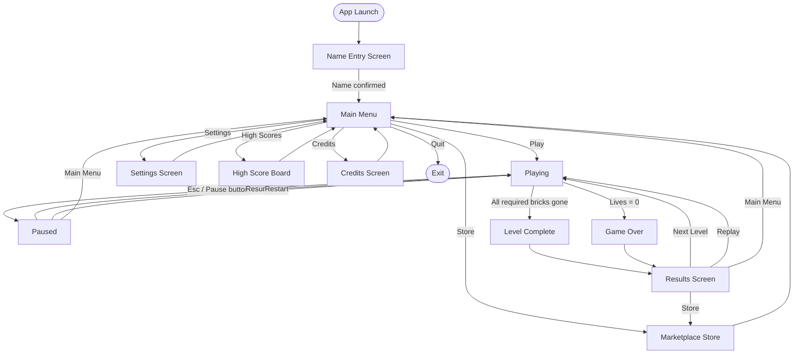

# Game Flow — BrickBlast: Velocity Market

## State Transition Diagram



---

## Detailed Player Journey

### 1. Application Launch (Boot)
- WinForms `Form1_Load` fires.
- Double buffering and timers are configured.
- Starfield, fonts, and store catalog are initialised.
- State transitions to `NameEntry`.

### 2. Name Entry
- Player types their name (up to 16 characters).
- Press Enter → `SetPlayerProfile(name)` resolves the save path.
- `LoadStore()` restores coins, owned items, and equipped skins.
- State transitions to `MainMenu`.

### 3. Main Menu
- Animated starfield background.
- Five options: Play, Store, Settings, High Scores, Credits.
- Arrow keys / mouse / gamepad navigate; Enter / click confirms.

### 4. Playing
- `StartNewGame()` seeds `_proceduralSeed`, resets score/lives, calls `LoadLevel(n)`.
- `LevelManager.LoadLevel(n)` generates brick palette and spawns brick grid.
- Ball is docked to paddle; click / space launches.
- Each timer tick: moves ball, checks collisions, updates HUD.
- Brick hit: `BrickManager.RegisterHit()` → decrement health → destroy if 0 → award score/coins.
- Reward brick: `CurrencyManager.AddCoins(reward)`.
- Hazard brick: ball speed increase or paddle shrink.
- Moving brick: position updated each tick along its lane.
- Power-up spawns: coloured/shaped by `_activeBonusPack`.
- Ball out-of-bounds: `_lives--`; if lives == 0 → `GameOver`.

### 5. Pause
- Freeze timer.
- Overlay shows Resume, Restart, Store, Main Menu.
- Resume restarts timer.

### 6. Level Complete
- `_bricksRemaining == 0` triggers `LevelComplete`.
- Score tallied; completion bonus coins calculated.
- `SaveStore()` persists updated balance.
- Results screen shown.

### 7. Game Over
- Final score shown.
- Partial coins earned are saved.
- Results screen offers Retry, Store, Main Menu.

### 8. Results Screen
- Animated score count-up.
- Shows run score, coins earned, total coins, new unlocks if any.
- Buttons: Next Level, Replay, Store, Main Menu.

### 9. Marketplace (Store)
- Three tabs: Balls | Bricks | Bonuses.
- Left/Right arrows cycle tabs; Up/Down arrows select item.
- Enter purchases (deducts coins, adds to `_ownedItems`, `SaveStore()`).
- E / Equip button equips the selected owned item.
- Equipped indicator shown on row and active label.
- Cosmetics apply immediately on next game start.

### 10. Save / Sync Flow
```
Purchase / Equip
   └─ SaveStore() writes JSON immediately

Level Complete / Game Over
   └─ SaveHighScores() updates leaderboard

Background (after save)
   └─ SyncProfileAsync() posts profile to endpoint
       ├─ Success → _syncStatus = Synced, timestamp updated
       └─ Failure → _syncStatus = Failed, gameplay unaffected
```

### 11. Offline Mode
- If `CheckConnectivity()` returns false, sync is skipped.
- `_syncStatus = Offline` shown in HUD corner.
- All local gameplay, purchasing, and saving function normally.
